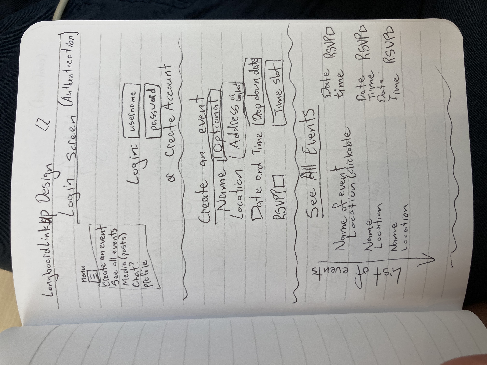
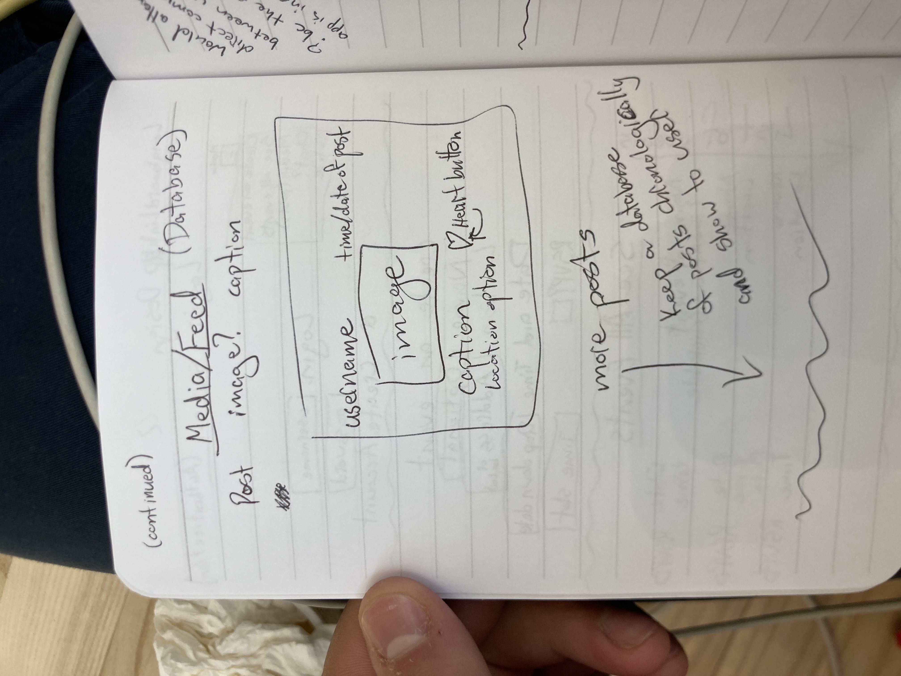
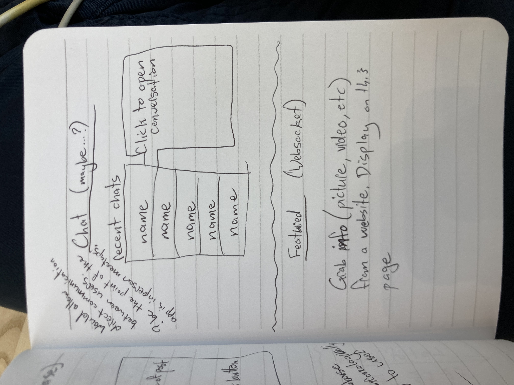

# This is the README file for LongboardLinkup
## LongboardLinkup is a web app designed to help longboarders meet up and plan events in Provo, UT.
Part of this inspiration comes from the Spikeball app, which allows players 
to meet up and see what events are going on near them

## Description
### Elevator Pitch
This is the place to find other people near you who are longboarding! Riding around for transportation is all good and fun, but there is so much more potential in your board just waiting to be unlocked. Social interactions are key to personal development, as is making progress on your personal goals. Physical exercise stimulates the brain and promotes longevity and quality of life. Spending time outdoors and moving is good for your mental health. Why not augemnt and share these amazing benefits through a LongboardLinkup? See what events are going on around you, or plan one yourself. Make new friends and coordinate schedules for even more fun 👍

### Design
The "Login", "Create" and "Events" screens

The "Feed" screen that shows posts from users

A design for a "Chat" feauture that I might add to the app, 
plus the websocket I will employ

## Technologies
...
